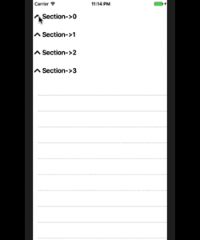

## JMExpandableTableView
A simple-to-integrate expandable table view, for iOS.



## How to Use

1. Copy the ```Core``` folder into your project.
2. Provide your own section view by implementing ```SectionViewDelegate```.
3. Make your controller inherit ```BaseExpandableTableViewController``` and override following 5 methods.

```
-(NSInteger)numberOfSectionsInTableView:(UITableView *)tableView;
```

```
// return YES if a section should be expanded by default when table view is loaded
-(BOOL)expTableView:(UITableView *)tableView expandSectionByDefault:(NSInteger)section;
```

```
// your controller should not override the default "tableView:numberOfRowsInSection:"
-(NSInteger)expTableView:(UITableView *)tableView numberOfRowsInSection:(NSInteger)section;
```

```
// provide your own section view implementation
-(id<SectionViewDelegate>)expTableView:(UITableView *)tableView sectionViewInSection:(NSInteger)section;
```

```
-(UITableViewCell *)tableView:(UITableView *)tableView cellForRowAtIndexPath:(NSIndexPath *)indexPath;
```

That's it!
